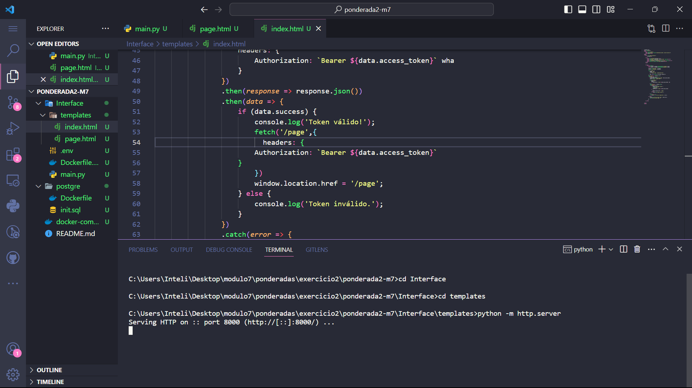
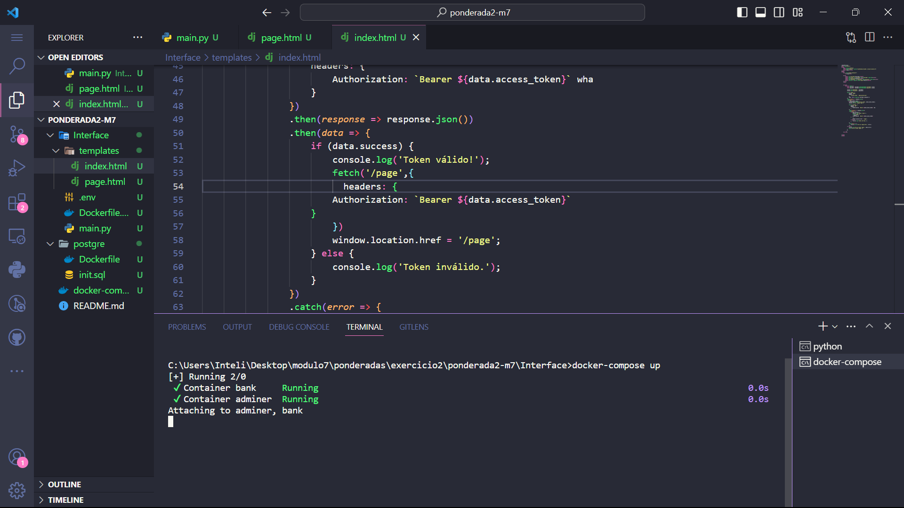
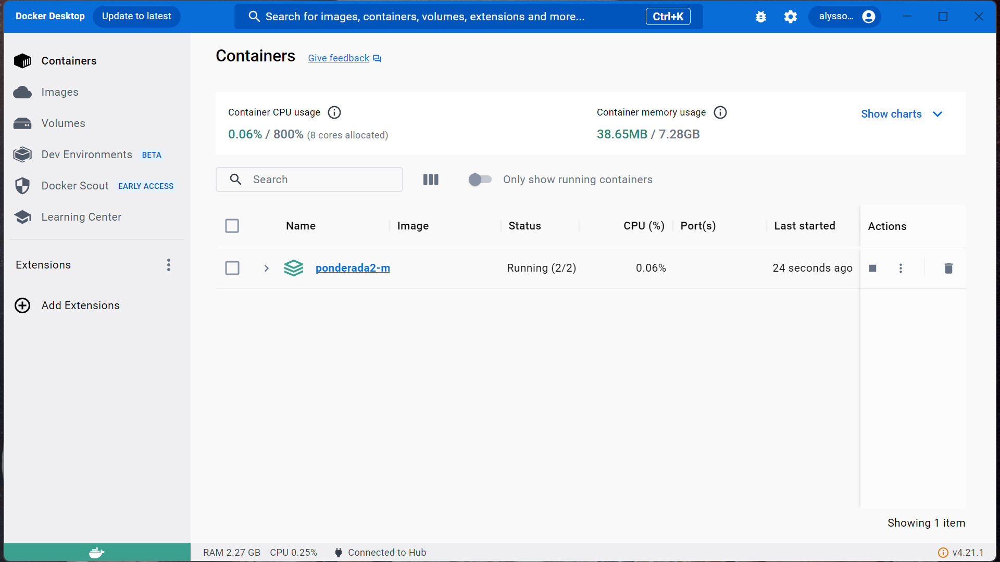

# ponderada2-m7
Atividade 2: Criação de uma aplicação protegida com CRUD

obs: a atividade não foi completada e finalizadas pelo requisitos por motivos de dificuldade com CRUD e pelo falo do Login não acessar a entrada da pagina. No caso do login, tampouco funciona o console.log na minha máquina. Ele não printa nada mesmo as rotas funcionando. Tentei pedir ajuda para o orientador Nicola, mas ele não conseguiu resolver.
---
---
O propósito deste projeto é a elaboração de um projeto online que viabilize aos utilizadores a inscrição de informações em uma base de dados. A implantação do banco de dados, assim como da API do back-end e da interface, está prevista por meio da aplicação de múltiplos recipientes. Não há obrigatoriedade de empregar estruturas pré-definidas; é viável desenvolver o projeto utilizando os recursos fundamentais disponíveis na linguagem de programação selecionada.

###  Execultado a aplicação:

#### Requisitos: 
1. Tenha o Docker Desktop rodando e aberto.

---
-  Abra o terminal "cmd" e caminhe para o diretório "templates". Execute com o comando "python -m SimpleHTTPServer
" para Python 2x ou "python -m http.server" para Python 3x.

Está rodando o front-end. Agora vamos rodar com Back-end, banco de dados e Docker-Compose

-- Para isso, abra outra terminal e execute através do comando "docker-compose up"

está acessando o banco e imagem

está rodando!
no front-end coloque o usuário e a senha que são, respectivamente, "alysson" e "alysson1984".

